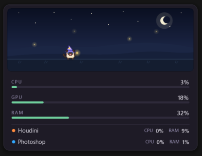

# Status Pet

A small always-on-top Windows widget that shows your **CPU, GPU and RAM** usage, with a pixel pet that reacts to how hard your PC is working.

## [⬇ Download for Windows](https://github.com/jutopian/status-pet/releases/latest/download/StatusPet-Setup.exe)

**StatusPet-Setup.exe** · Windows 10 / 11 · no Python needed · [all releases](https://github.com/jutopian/status-pet/releases) · [website](https://jutopian.github.io/status-pet/)

## Features

- **Live numbers:** CPU, GPU and RAM, plus a row for each open session of the apps you track (CPU and memory per app).
- **GPU on any card:** NVIDIA, AMD and Intel.
- **A pet that reacts:** it walks, blinks, dozes off when you're away, and plays an effect (magic, painting, building, cooking…) when your PC is busy.
- **Pets and hats:** slime, Siamese cat, jack-o'-lantern and ghost; hats come from PNG files in the `src/hats/` folder.
- **Three views:** Full, Compact and One line, with an optional see-through background.
- **10 languages.**
- **Light:** usually 1–3% of one CPU core.

## Run from source

1. Install **Python 3** from [python.org](https://www.python.org/downloads/). Nothing else is needed; it only uses the standard library.
2. Download this repository (green **Code** button → **Download ZIP**) and unzip it.
3. Double-click **`src/status_pet.pyw`**.

Point at the gadget to show the view buttons and the Settings gear. Right-click the tray icon to quit.

When run from source, options are saved in `settings.json` next to the script. The installed app saves them in `%LOCALAPPDATA%\Status Pet`.

## Folders

| Folder | What's inside |
|---|---|
| `src/` | The app: `status_pet.pyw` and everything it needs |
| `tools/` | Tests and asset tools for development |
| `installer/` | Builds the Windows installer with `tools/build_installer.py` (needs PyInstaller and Inno Setup) |
| `docs/` | The screenshot above |

Inside `src/`:

| File | What it does |
|---|---|
| `status_pet.pyw` | Status Pet: the window, the pet and the drawing |
| `settings_ui.py` | The Settings window |
| `metrics.py` | Reads CPU, GPU, RAM and per-app usage |
| `gfx.py` | Drawing and window helpers (GDI+, see-through window) |
| `sprites*.py` | Pixel art for each pet and effect |
| `hats.py`, `hats/` | Hats (one PNG per hat) |
| `seasons.py` | Seasonal pets and effects (e.g. Halloween) |
| `i18n.py`, `lang/` | Translations |
| `tray.py`, `update_check.py`, `autostart.py` | Tray icon, update notice, start with Windows |
| `assets/` | The app icon |

## License

[MIT](LICENSE) © 2026 jutopian
